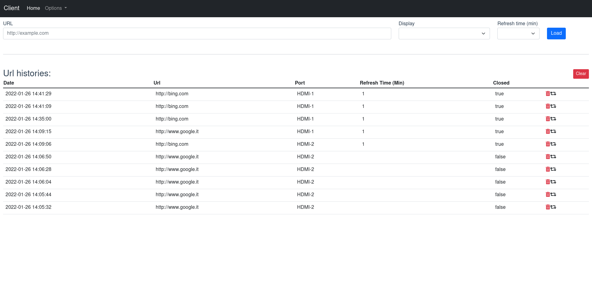
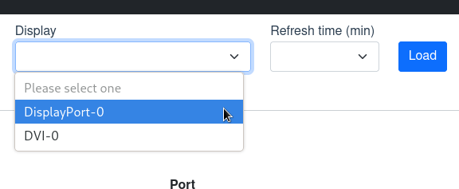

Videowall-client help you to open and manage browsers on remote devices based on linux distro.



You can use it in standalone mode or remotelly by [videowall-server](https://github.com/Edsol/videowall_server) app.

the system detects connected monitors via [xrandr](https://www.x.org/releases/X11R7.5/doc/man/man1/xrandr.1.html), will be saved to the database



---

### Device setup (Optional)

If you need to prepare a device from scratch, an installation file is available in `install/install.sh`.

Start with a DE-less installation (I started with a [debian netinst](https://www.debian.org/CD/netinst/)), bash will install all necessary package.

For a saving of resources I have used `openbox` and `lightdm`, a minimal [`conky`](https://github.com/brndnmtthws/conky) setup file will be loaded to show basic information of device (on first monitor).

AMD drivers will be installed, if they are not needed for your setup you will have to remove the lines before performing the installation.

---

### Project setup

After cloning the repository you need to install the dependencies:

```
npm install
npm i -g concurrently nodemon

```

and generate the database file:

```
npx prisma db push
```

### Compiles and hot-reloads for development

```
npm run serve
```

### Compiles and minifies for production

```
npm run build
```

### Run on device

To run it use [pm2](https://github.com/Unitech/pm2) process manager, you can start with:

```
pm2 start pm2.config.js
```

#### Disclaimer

Tested only on **HP Thin Client T610** but presumably it can run on every devices linux based

### License

videowall-client is made available under the terms of the GNU Affero General Public License 3.0 (AGPL 3.0)
